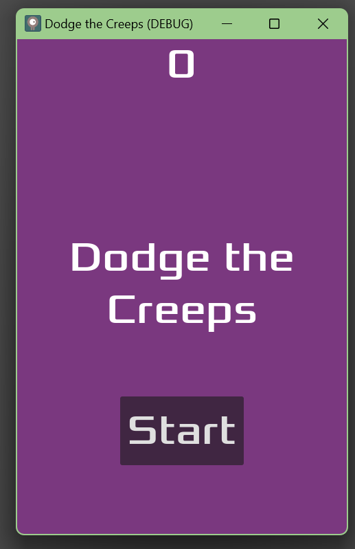
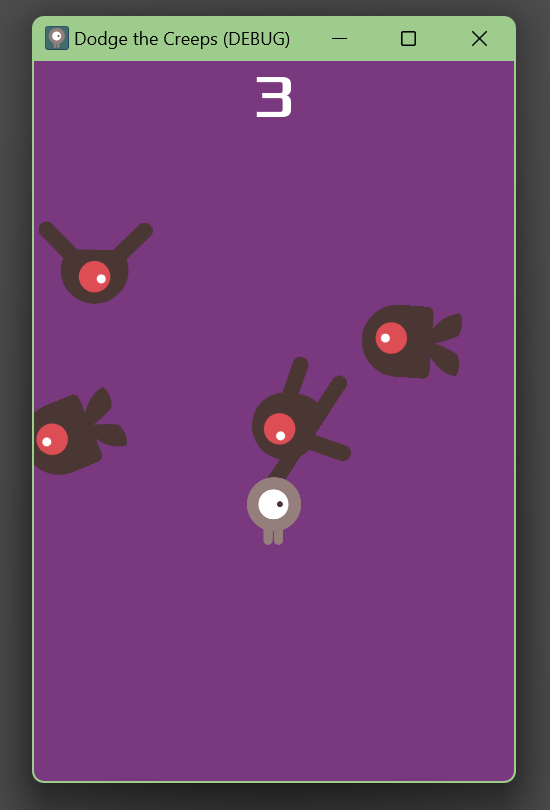
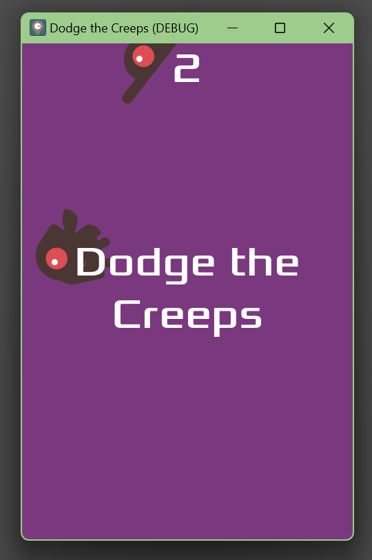

# Primer videojuego en 2d usando Godot

Godot es un motor de juegos de código abierto y gratuito que permite desarrollar juegos 2D y 3D. Ofrece un editor visual intuitivo, soporte para múltiples plataformas y un lenguaje de programación propio llamado GDScript. Es conocido por su comunidad activa y su enfoque en la accesibilidad y la flexibilidad para los desarrolladores.

## Screenshots

